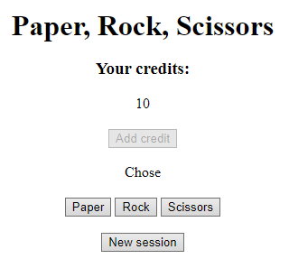
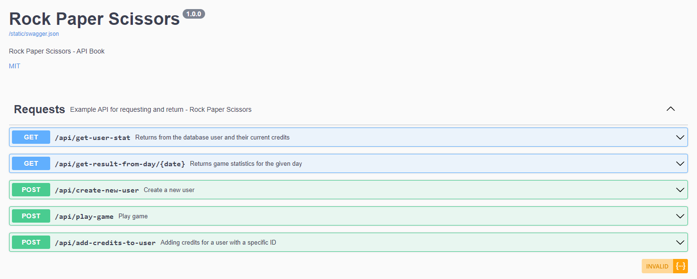

# Rock Paper Scissors game with API online presentation

## Go to
`http://rock-paper-scissors2.herokuapp.com/`

## You can get acquainted with API functions (Swagger)
`http://rock-paper-scissors2.herokuapp.com/swagger/`

# Rock Paper Scissors game with API desktop

## Clone repo 
`git clone https://github.com/WiktorBoro/rock-paper-scissors.git`

## Install lib
`pip install  -r requirements.txt`

## Run app.py
`python app.py`

Main page localhost:5000/

You can get acquainted with API functions (Swagger) on your localhost:5000/swagger/